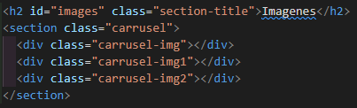



**Mi primer sitio web**

|**AUTORÍA**|Lucas Zarandón|
| - | :-: |
|**ESPACIO DE CAPACITACIÓN**|Conectar Lab|
|**DURACIÓN**|2 horas|
|**FRECUENCIA**|Único encuentro  |
|**DESTINATARIOS** |12 a 18 años|
|**FECHA DE INICIO**|Enero / Febrero|

**OBJETIVOS:** 

En este encuentro de programación nos encontraremos con HTML (lenguaje de estructura) y CSS (lenguaje de estilos). La idea del taller de hoy es crear nuestro primer sitio web a partir de un template, como objetivo tenemos que conseguir que los chicos elijan un personaje, dibujo, anime, película, serie o tema de interés que les agrade y puedan crear así el sitio web de agrado.

**CONTENIDOS:** 

- Conocimiento de la estructura de la web.
- Introducción al lenguaje HTML y CSS.
- Carga y descarga de archivos con extensión jpg, png. O bien usar la url de la imagen de internet.

**MATERIALES:**

Computadoras, Proyector o Televisor, Internet.

**TEMPLATE DEL SITIO WEB:**

https://github.com/LucasZarandon/Mi-primer-sitio-web-conectarLAB

**DESARROLLO:**

1. Para comenzar a trabajar con nuestro sitio web necesitaremos descargar el template del [repositorio de github](https://github.com/LucasZarandon/Mi-primer-sitio-web-conectarLAB). **Nota:** si llegamos a romper el proyecto y la función deshacer no nos funciona siempre podremos volver a empezar desde el template. Para poder trabajar en nuestro archivo es necesario descargarlo en formato zip, para ello una vez estemos en el link del repositorio debemos:
1. Clickear sobre el botón verde “ < >  Code ⬇”.
1. Luego clickear sobre [Download ZIP](https://github.com/LucasZarandon/Mi-primer-sitio-web-conectarLAB/archive/refs/heads/main.zip).

1. Luego de descargarlo tendremos que descomprimirlo, para hacerlo nos dirigimos a la carpeta de descargas y arrastramos nuestro archivo .zip hacia el escritorio o a un lugar que podamos encontrarlo fácilmente. Primero hacemos click derecho sobre el archivo y luego sobre la opción Extraer aquí.
1. Una vez descomprimido el archivo procedemos a abrir la herramienta que nos ayudará a editar el código. Les presento a Visual Studio Code (VSC), para poder ejecutar el programa debemos:
   1. En la barra de tareas (parte inferior izquierda de la pantalla), debemos hacer click sobre Aplicaciones.
   1. Luego dirigirnos a Programación.
   1. Por último nos dirigimos a Visual Studio Code.
1. Una vez dentro de VSC, para poder abrir la carpeta con el template debemos:
   1. En la barra de herramientas (parte superior izquierda) hacemos click sobre archivo.
   1. Luego abrir carpeta, buscamos mediante el gestor de carpetas la localización de nuestra carpeta recién descomprimida.
   1. Una vez abierta la carpeta en VSC nos debe aparecer la siguiente estructura.

\>**Estilos:** dentro de esta carpeta encontraremos los estilos del sitio web, de esta carpeta sólo nos interesara el archivo con el nombre fotos-carrusel.css.

\>**Funciones:** dentro de esta carpeta nos encontraremos algunas funciones creadas con el lenguaje de programación Javascript, no hay que modificar el archivo que se encuentra dentro.

\>**LogosConectarLAB:**  dentro de esta carpeta encontraremos imágenes en formato png para la creación del sitio web.

\>**index.html:** en este archivo encontraremos la estructura del sitio web es decir los elementos o etiquetas que componen cada elemento visible del sitio. 

\>**README.md:** este archivo sirve para mostrar a nuestros espectadores una pequeña descripción de nuestro proyecto en el repositorio.

1. Una vez reconocida nuestra área de trabajo comenzaremos a personalizar nuestro sitio. Iniciamos reconociendo las partes del archivo **index.html**. 

Dentro del archivo nos encontraremos con lo que es el lenguaje de etiquetas de HTML, entenderemos este lenguaje como si fueran cajas que dentro pueden tener más cajas, nuestra caja más grande es **<body>** que dentro tenemos todo nuestro sitio web dividido en secciones (**<section>**), iremos trabajando seccion a seccion nuestra aplicación: 

- La sección banner: dentro del elemento **<section class=”banner”>** encontraremos nuestras etiquetas a modificar.

**<h1>** es nuestro título principal, lo que debemos modificar de este elemento es el contenido. 

<h1>**Este es el contenido de un elemento**<h1>

**
** es la descripción que acompaña al título principal también modificaremos el contenido del elemento 

**** es el elemento que posee la imagen dentro del elemento encontraremos el atributo **src=””** entre las comillas nos encontraremos con el link a la imagen, este atributo puede recibir tanto rutas relativas como absolutas y rutas locales como externas, osea internet. 

- Ahora vamos a trabajar con la sección de las imágenes  **<section class=”carrusel”>**. A diferencia de la sección anterior esta sección está implementando el recurso de las imágenes mediante estilos quiere decir que no vamos a modificar el archivo index.html sino que dentro de la carpeta **Estilos** nos encontraremos el archivo **fotos-carrusel.css** Dentro del archivo encontraremos tres propiedades que representan cada una de las imágenes. Para cada imagen tendremos una función **url(“ ”)** que representa el src de los elementos html dentro de ella encontramos envuelta de comillas la ruta hacia la imagen.

- Dentro de la tercera sección **<section class="informacion">** encontraremos una serie de cartas o artículos **<article>**, cada uno representa la carta virtual en el navegador. Esta cuenta con las siguientes etiquetas a modificar.

Nuevamente el elemento **** a éste únicamente le modificaremos el atributo **src=""** con la ruta a la imagen que elijamos. 

El elemento **<h3>** representa el título de la carta, solo modificaremos el contenido de la etiqueta.

Por último la etiqueta **
** que representa la descripción de la carta.

**OPCIONAL: CAMBIO DE ALGUNOS COLORES DEL SITIO**

Como actividad opcional tenemos la alternativa de poder cambiar los colores tanto del fondo de las secciones como de los colores de la fuentes, para ello debemos por cada sección cambiar el color dentro de su archivo específico.

**Cambio de colores de la sección banner:** dentro de la carpeta **Estilos** encontraremos el archivo **banner.css**, dentro del archivo están especificados qué propiedades podemos modificar para poder cambiar los colores.

**Cambio de colores de la sección carrusel:** dentro de la carpeta **Estilos** encontraremos el archivo **carrusel.css**, dentro del archivo están especificados qué propiedades podemos modificar para poder cambiar los colores.

**Cambio de colores de la sección información:** dentro de la carpeta **Estilos** encontraremos el archivo **informacion.css**, dentro del archivo están especificados qué propiedades podemos modificar para poder cambiar los colores.

**OPCIONAL: SUBIR EL SITIO WEB A INTERNET**

Para poder subir el sitio a internet necesitaremos un host, en nuestro caso un sitio web que se encargue de ello, para esto no sirve el [**Github**](http://www.github.com/login), para poder entender más la página recomiendo traducirla al español.

**Username:** 

**Password:** 

Una vez ingresado a la cuenta en la parte lateral izquierda encontraremos la opción de crear un nuevo repositorio en github, es decir una carpeta igual a la que tenemos en nuestro escritorio pero en la nube 😎 genial, ¿no?

Al presionar sobre el botón verde nos redirigirá a la página de creación de nuestro repositorio. En esta parte únicamente debemos completar con un nombre único de repositorio, recomendablemente el nombre de cada uno de los alumnos. Será opcional la descripción del repo pues ya nuestro proyecto cuenta con un archivo **README.md**.

Cuando completamos con el nombre del repositorio debemos clickear sobre el botón y ya nos dirigirá hacia el nuevo repositorio.

Dentro del repositorio tenemos la opción de cargar un archivo existente, figura de color azul debajo de la url del sitio. 

Una vez ahí, únicamente falta arrastrar todos nuestros archivos dentro, dejando el archivo **index.html** en el último nivel, clickeamos el botón de cometer cambio y el repositorio nos debería de quedar de la siguiente manera.

